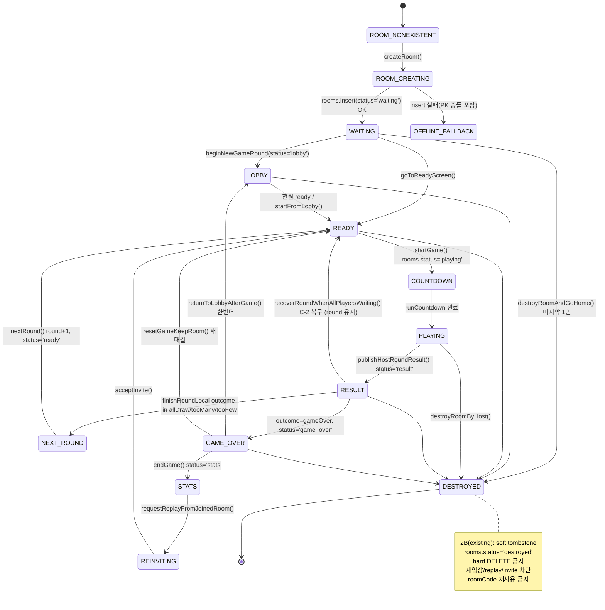
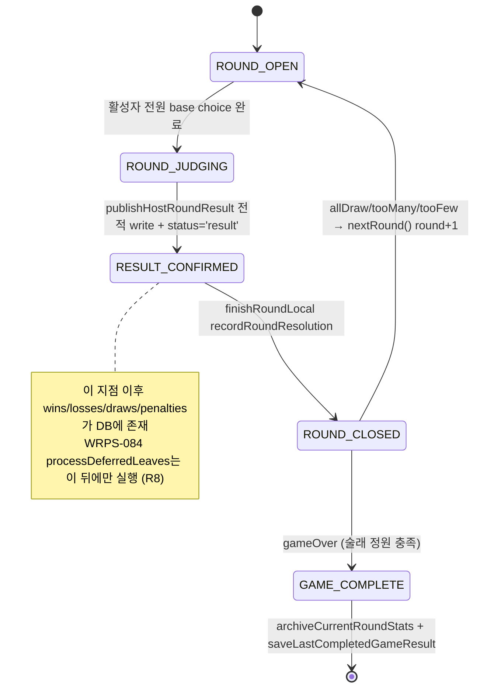
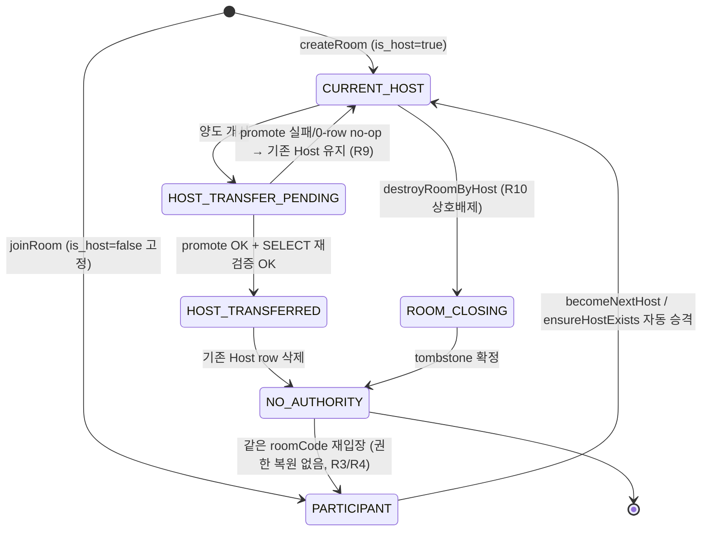
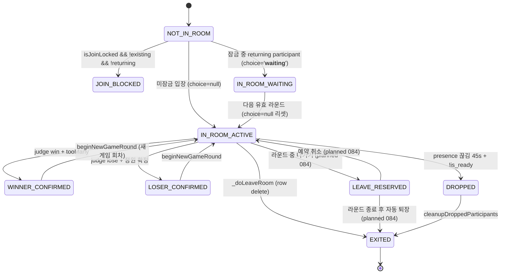
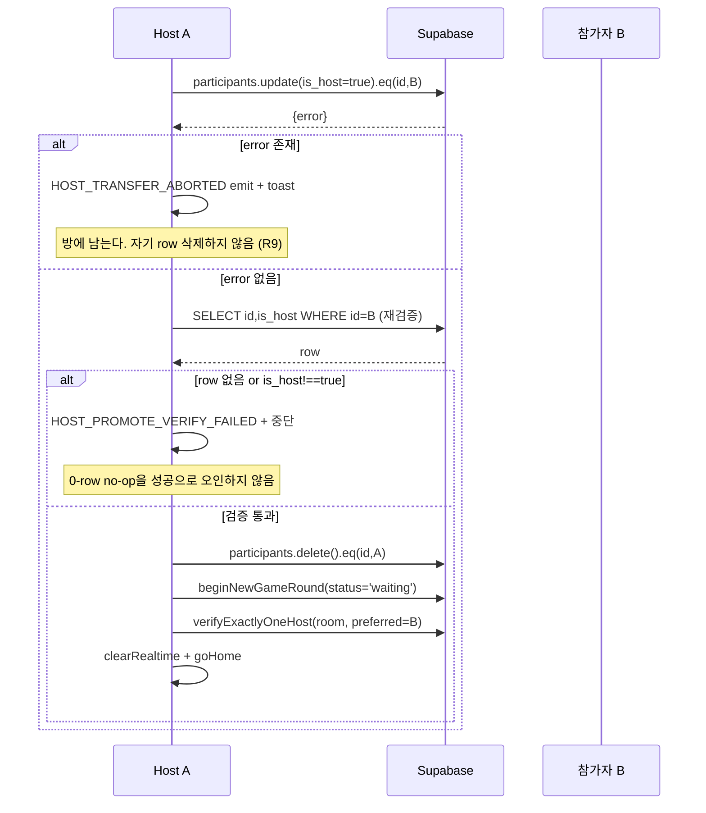
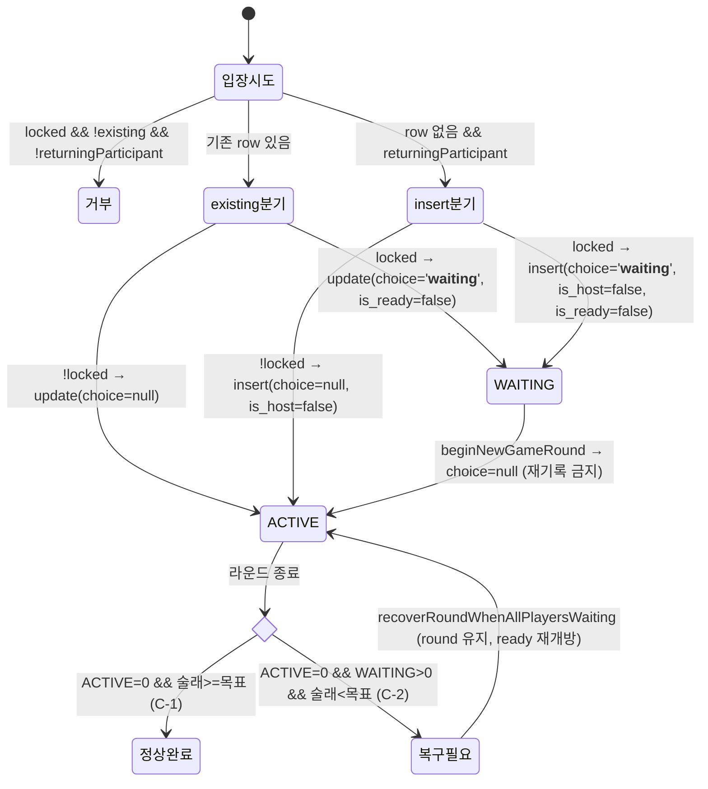
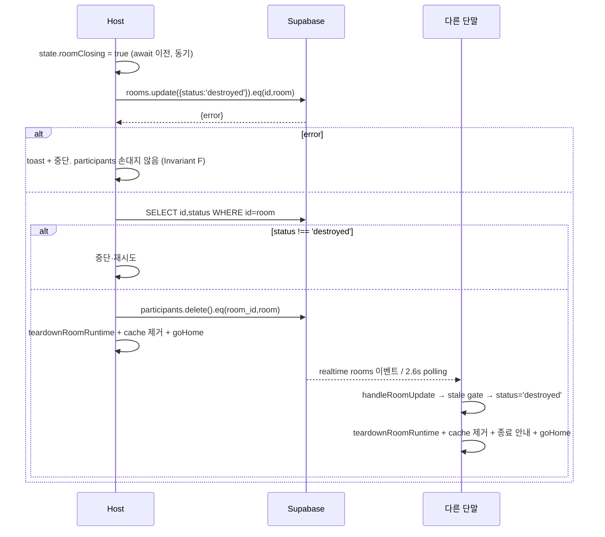
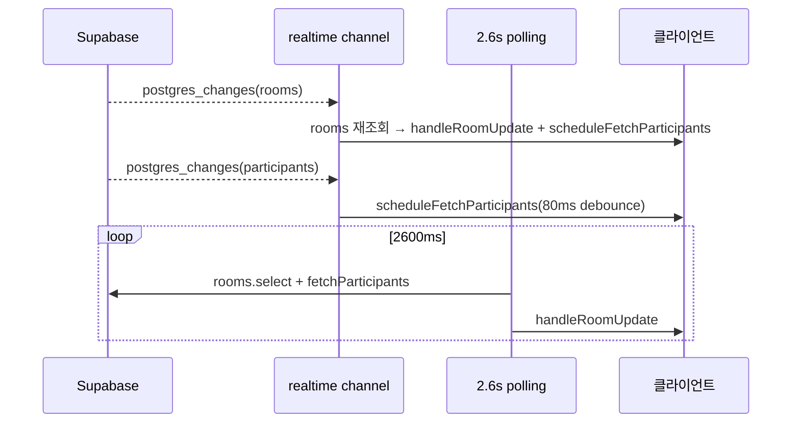

# RPS Room Lifecycle Architecture

> **STATUS: Living — WRPS-083 2B 구현 반영됨**
> 기준 HEAD `281cb715af466825118d08ccbfe5ae31db3775fb` + WRPS-083 2B 작업본(커밋 대기)
> `existing`은 코드에 실재, `planned`는 설계만. WRPS-084 관련 항목은 여전히 planned다.
> 라인 번호는 2B 반영 후 기준이다.

방 생성부터 종료까지 Room·Game·Host·Participant lifecycle의 기준 문서다.

- **기준 커밋**: `f6f7eb759fbe99ea0c8d983bbd82f67271115f75`
- **인덱스**: `docs/RPS_STATE_DIAGRAM_INDEX.md`
- 라인 번호는 기준 커밋 기준이며, **함수명을 라인보다 우선 신뢰**한다.

---

## 1. 4축 분리 모델 (이 문서의 핵심 전제)

RPS의 상태는 하나의 축이 아니라 **서로 독립적인 4개 축**의 곱이다. 과거 장애 대부분은 이 축을 섞어 하나의 필드에 밀어 넣은 데서 나왔다.

| 축 | 권위 데이터 | 값 | 독립성 |
|---|---|---|---|
| **Room** | `rooms.status` | waiting / lobby / ready / playing / result / game_over / stats / reinviting / penalty_setting / **destroyed**(existing, 2B) | Game·Host·Leave와 독립 |
| **Game/Round** | `rooms.round`, `rooms.penalty`의 gameRound | round 1..N, gameNo 1..M | Host 교체와 독립 |
| **Host authority** | `participants.is_host` | CURRENT_HOST / PARTICIPANT | 라운드 참여와 독립 (**R2**) |
| **Round participation** | `participants.choice` → `computePlayerStatuses` | ACTIVE / WAITING / WINNER_CONFIRMED / LOSER_CONFIRMED | Host 권한과 독립 (**R2**) |
| **Leave lifecycle** (planned) | `participants.leave_after_round` | false / true | 위 4축 전부와 독립 |

> `rooms.status`는 **enum이 아니라 개방형 텍스트 컬럼**이다(운영 REST 조회로 확인, 실측 9종). 상태 판정은 **화이트리스트가 아니라 필요한 값만 명시 비교**해야 한다 — 화이트리스트로 짜면 `penalty_setting` 같은 기존 값이 부수적으로 차단된다.

**금지 사항 (과거 결함의 원인)**
- `choice` 컬럼에 새 lifecycle 의미를 추가하는 것. 현재 이미 판정 입력 + 3개 마커(`__safe__`/`__loser__`/`__waiting__`) + 인코딩 결과(`base|result|auto`)로 과적재되어 있다.
- `is_ready`를 참여 의사 외의 용도로 재사용하는 것.
- `is_host`를 게임 판정에 참조하는 것 (WRPS-042/043에서 심판 모델 폐지).

---

## 2. Level 0 — 전체 Room Lifecycle



**텍스트 요약 (Mermaid 미렌더 시)**
`없음 → 생성중 → waiting → (lobby) → ready → countdown → playing → result → {다음 라운드 ready | game_over} → {stats | lobby | ready} → (reinviting) → ready` 이며, 어느 상태에서든 `destroyed`로 갈 수 있고 `destroyed`는 terminal이다. `result → ready`로 돌아가는 경로가 두 개 있다: `nextRound()`(round 증가)와 `recoverRoundWhenAllPlayersWaiting()`(round 유지, C-2 복구).

| 상태 | 권위 값 | 진입 함수 | 상태 |
|---|---|---|---|
| ROOM_CREATING | — | `createRoom` `index.html:6539` | existing |
| WAITING | `status='waiting'` | `createRoom`, `_doLeaveRoom:10977` | existing |
| LOBBY | `status='lobby'` | `beginNewGameRound:5220` | existing |
| READY | `status='ready'` | `nextRound:9864`, `goToReadyScreen`, `recoverRoundWhenAllPlayersWaiting:13017` | existing |
| PLAYING | `status='playing'` | `startGame` | existing |
| RESULT | `status='result'` | `publishHostRoundResult:6149` | existing |
| GAME_OVER | `status='game_over'` | `finishRoundLocal:8233` (3곳, 조건부 write) | existing |
| STATS | `status='stats'` | `endGame:9969 근방` | existing |
| REINVITING | `status='reinviting'` | `requestReplayFromJoinedRoom:7242` | existing |
| DESTROYED | `status='destroyed'` | `destroyRoomByHost:11323`, `destroyRoomAndGoHome:11183` | **existing (2B)** |

---

## 3. Level 1 — Room State Machine (writer 관점)

**단일 writer 원칙**: `rooms.status`는 원칙적으로 **현재 Host만** 쓴다. 예외는 `createRoom`(아직 host 개념 성립 전)과 `destroyRoomAndGoHome`(마지막 1인).

| 전이 | writer | guard | 비고 |
|---|---|---|---|
| → playing | host | 전원 ready | `startGame` |
| → result | host | 활성자 전원 선택 완료 | `publishHostRoundResult:6149` |
| → game_over | host | `.eq('status','result')` 조건부 | WRPS-081 2-writer 레이스 방어 |
| → ready (round+1) | host | `advancingRound` 뮤텍스 | `nextRound:9864` |
| → ready (round 유지) | host | C-2 8조건 + 2회 관측 | `recoverRoundWhenAllPlayersWaiting:13017` |
| → waiting | 이탈하는 host | `_doLeaveRoom:11160` + `!isRoomClosingOrDestroyed()` | **2B 적용됨(CRITICAL 해소)** |
| → destroyed | host | `roomClosing`/`hostTransferInFlight` 상호배제 + DB is_host 재확인 | `destroyRoomByHost:11323` (existing) |

---

## 4. Level 1 — Game / Round State Machine

**Room 축과 분리해야 하는 이유**: 같은 게임(gameNo 고정) 안에서 round만 1→2→3으로 올라가는 다중 술래 재대결이 존재한다. Room status는 `ready↔playing↔result`를 반복하지만 gameNo는 그대로다.



**판정 결과 4종** (`resolveElimination`, `src/game-logic.mjs:104`)
- `allDraw` — 전원 무승부, 같은 후보로 재대결
- `gameOver` — 패자 수 == 남은 슬롯, 종료
- `tooMany` — 패자 > 슬롯, 패자끼리 재대결(승자 안전 확정)
- `tooFew` — 패자 < 슬롯, 패자 확정 + 승자끼리 추가 대결

**deadlock 방지 분기**: 활성자 수 ≤ 남은 슬롯이면 전원 술래 확정 후 gameOver (`src/game-logic.mjs:117`). 중도 퇴장으로 1명만 남아 무한 무승부에 빠지는 것을 막는다. **WRPS-084 퇴장 예약이 이 분기와 만나는 지점**이므로 §7에서 다시 다룬다.

---

## 5. Level 1 — Host Authority State Machine



**R3/R4의 코드 강제 지점**: `joinRoom:7208`의 insert payload가 `is_host: false`로 **고정**되어 있고, `state.role`은 `"participant"`로 무조건 대입된다. `state.joinRecentRoom.role`이 `'host'`여도 참조하지 않는다. 검증: `tests/waiting-state-stage2a.test.mjs` W11 / mutation M9·M10.

**R1의 코드 강제 지점 3중**
1. `promoteParticipantToHost:10861` — update 후 SELECT 재조회로 `is_host===true` 실제 반영 확인. 0-row no-op을 성공으로 오인하지 않는다.
2. `verifyExactlyOneHost:10896` — 승격 직후 행위 단말이 호출. host 2명이면 `preferredHostId`를 남기고 나머지 해제, 0명이면 재승격.
3. `ensureHostExists:12980` — host 0명을 **연속 2회** 관측했을 때만 결정적 후보(`created_at` 최소, 동률 시 `id` 오름차순)를 승격. 후보 본인 단말만 write하므로 중복 write가 원천 차단된다.

---

## 6. Level 1 — Participant Lifecycle



**우선순위 (`computePlayerStatuses`, `src/game-logic.mjs:63`)**
```
LOSER_CONFIRMED > WINNER_CONFIRMED > WAITING > ACTIVE
```
WAITING이 확정보다 뒤인 이유: `choice`는 단일 값이라 확정자가 퇴장 후 라운드 중 재입장하면 `'__waiting__'`으로 덮인다. WAITING이 이기면 **확정 술래가 재입장만으로 부활**해 판정이 뒤집힌다. 검증: W2/W3, mutation M2.

---

## 7. Level 2 — WRPS-083 Host Transfer



| 전이 | function | test | mutation | WRPS | status |
|---|---|---|---|---|---|
| 승격 write | `promoteParticipantToHost:10861` | T1/T2/T2b | stage1 T6(a) | 083-1 | existing |
| exactly-one 수렴 | `verifyExactlyOneHost:10896` | T1/T5, W27 | — | 083-1 | existing |
| 후보 결정 | `pickDeterministicHostCandidate:10844` | T3/T4, W26 | — | 083-1 | existing |
| 명시 양도 | `transferHostAndLeave:11043` | T1/T2, W5/W6 | M10 | 083-1 | existing |
| 자발 승격 | `becomeNextHost:11080` | stage1 becomeNextHost | — | 083-1 | existing |
| 자동 복구 | `ensureHostExists:12980` | T3/T6(b), W25 | T6(b) | 083-1 | existing |

**becomeNextHost의 write 순서 역전**: 해제 → 승격이 아니라 **승격 → 해제**다. 중간 실패의 최악 모드가 "host 2명"(수렴 가능)이지 "host 0명"(수렴 불가)이 아니게 만든다.

---

## 8. Level 2 — WRPS-083 2A WAITING / Rejoin



**GAP-1 (2A에서 수정됨)**: `returningParticipant=true`인데 row가 없으면 insert 분기로 가는데, 종전에는 여기에 `choice`가 없어 NULL → 즉시 ACTIVE가 됐다. 1단계 `transferHostAndLeave`가 양도한 host의 row를 **delete**하므로, 그 사용자가 라운드 중 재진입하면 정확히 이 경로였다. 검증: W14/W15, mutation M3.

**C-2 8조건** (`recoverRoundWhenAllPlayersWaiting:13017`): `role==='host'` / `ACTIVE===0` / `WAITING>0` / `confirmedLoserIds.length < target` / `!roomClosing` / `!gameStarting` / `!advancingRound` / **2회 연속 관측**. 1회 관측에서는 write 0건이다(W21). `rooms.update`에 `round` 필드를 싣지 않는 것으로 라운드 미증가를 구조적으로 보장한다(W23).

---

## 9. Level 2 — WRPS-083 2B Room Destroy **(existing)**



**핵심 설계 근거**: 현재 `destroyRoomAndGoHome:11008-11012`는 **hard DELETE**다. 그 결과 남은 단말의 `.single()` 조회가 row 없음을 받고 `if (room)` 가드에서 **아무 것도 하지 않는다** — 종료가 전파되지 않는다. soft tombstone은 row를 남겨 기존 2경로(realtime + polling)로 자연 전파시킨다.

**destroyed 가드가 필요한 writer** (2B 필수):
`ensureHostExists`(HIGH) / `recoverRoundWhenAllPlayersWaiting`(HIGH) / `_doLeaveRoom`의 `status:'waiting'` write(**CRITICAL** — tombstone 부활) / `beginNewGameRound`(HIGH) / `transferHostAndLeave` / `becomeNextHost` / `leaveRoomForce` 자동 승격 / `requestReplayFromJoinedRoom` / `acceptInvite` / `resyncRoomOnResume` / `cleanupDroppedParticipants`.

공통 helper `isRoomClosingOrDestroyed():4911`(existing) 1개로 처리한다. 실제 적용은 **19지점**이다(설계 13 + 전수 재확인에서 추가된 5: `startGame`·`nextRound`·`autoStartDrawRematch`·`directStartGame`·`savePenalty`). **화이트리스트가 아니라 `status === 'destroyed'` 단일 비교**여야 한다(§1의 개방형 status 이유).

---

## 10. Level 3 — Writer Inventory

기준 커밋에서 `rooms`/`participants`에 쓰는 지점은 **59곳**이다(주석 1건 제외). 소유자별 요약:

| writer 함수 | table | op | 라인 | 소유자 |
|---|---|---|---|---|
| `createRoom` | rooms/participants | INSERT | 6572, 6579 | 생성자 |
| `joinRoom` | participants | UPDATE/INSERT | 7203, 7208 | 입장 본인 |
| `requestReplayFromJoinedRoom` | participants/rooms | INSERT/UPDATE | 7265–7271 | 재초대 host |
| `addDemoParticipant` | participants | INSERT | 7298 | 내부 도구 |
| `beginNewGameRound` | participants/rooms | UPDATE | 5287, 5290 | host |
| `publishHostRoundResult` | participants | UPDATE | 6187 | **host 전용** |
| `updateRoomStatus` / `updateRoomStatusScheduled` | rooms | UPDATE | 6382, 6390 | host |
| `updateParticipantChoice` | participants | UPDATE | 6395 | 본인 |
| `startGame` | participants/rooms | UPDATE | 7414–7435 | host |
| `nextRound` | participants/rooms | UPDATE | 9890–9904 | host |
| `autoStartDrawRematch` | participants/rooms | UPDATE | 9728, 9736 | host |
| `finishRoundLocal` | participants/rooms | UPDATE | 8360, 8666, 8691, 8739 | host (조건부) |
| `autoFillChoices` | participants | UPDATE | 8091 | host |
| `markReady` / `markReadyFromLobby` / `goToReadyScreen` | participants | UPDATE | 10705–10754, 12911 | 본인/host |
| `promoteParticipantToHost` | participants | UPDATE | 10864 | 승계 행위 단말 |
| `verifyExactlyOneHost` | participants | UPDATE | 10916 | 승계 행위 단말 |
| `becomeNextHost` | participants | UPDATE | 11104 | 승계 대상 본인 |
| `recoverRoundWhenAllPlayersWaiting` | participants/rooms | UPDATE | 13047–13076 | host |
| `_doLeaveRoom` | participants/rooms | DELETE/UPDATE | 10982–10994 | 이탈 본인 |
| `transferHostAndLeave` | participants | DELETE | 11057 | 이탈 본인 |
| `destroyRoomAndGoHome` | participants/rooms | DELETE | 11011, 11012 | 마지막 1인 |
| `cleanupDroppedParticipants` | participants | DELETE | 5550 | host |
| `cleanupDuplicateRoomProfiles` | participants | DELETE | 6841 | 본인 |
| `cleanupMyUnavailableRoomProfiles` | participants | DELETE | 6855 | 본인 |
| `savePenalty` / `onLoserCountChange` / `republishCountdownStartAsHost` / `publishChoiceWindowEnd` | rooms | UPDATE | 6723, 7367, 7490, 7724 | host |
| `inviteForReplay` | rooms | UPDATE | 10005 | host |
| `destroyRoomByHost` | rooms/participants | UPDATE/DELETE | 11323 | host | **existing (2B)** |
| `setLeaveAfterRound` | participants | UPDATE | — | 본인 | **planned (084)** |
| `processDeferredLeaves` | participants | DELETE | — | 예약 본인 | **planned (084)** |

**신규 writer를 추가하면 이 표를 갱신한다**(인덱스 §4-3).

---

## 11. Level 3 — realtime / polling convergence



**두 경로는 완료 순서를 보장하지 않는다.** 그래서 `handleRoomUpdate:5634`에 2중 stale gate가 있다.
1. **gameRound 축** — `incomingGameRound > 0 && incomingGameRound < state.gameRound`면 skip
2. **round 축**(WRPS-082) — 같은 게임 안에서 과거 round를 든 row 차단
3. **self-heal** — 동일 stale이 `STALE_ROOM_UPDATE_SELF_HEAL_THRESHOLD = 5`회 연속이면 1회 통과시켜 락업 해제

**destroyed 분기는 반드시 stale gate 뒤에 둔다**(2B §8). 앞에 두면 오래된 row로 오종료된다.

---

## 12. Level 3 — Timer / Channel teardown **(existing, `teardownRoomRuntime:11208`)**

`teardownRoomRuntime()` 멱등 함수 1개로 통합한다. 대상 17종:

| # | 자원 | 현재 정리 위치 | 비고 |
|---|---|---|---|
| 1 | `state.pollInterval` | `clearRealtime:4704` | |
| 2 | `state.fetchParticipantsTimer` | `clearRealtime` | |
| 3 | realtime room channel | `clearRealtime` `db.removeChannel` | |
| 4 | presence (같은 채널 합승) | 위와 동일 | |
| 5 | **presence 익명 타이머 5.5s/13s** | **없음** | `index.html:5599, 5600` — 핸들 미보관, 취소 불가. teardown 후에도 깨어나 `participants.delete`를 실행할 수 있다 → **HIGH** |
| 6 | `state.timer`, `state.animationTimer` | `stopRoundTimers:8005` | |
| 7 | `state.gameOverCountdownTimer` | `stopGameOverCountdown` | |
| 8 | `state.gameOverTimeout` | 개별 clearTimeout | |
| 9 | `state.rematchAdvanceTimer` | `discardInProgressRoomSession` | |
| 10 | `state.roundJudgeDeferTimer` | 〃 | |
| 11 | `state.globalInviteTimer` | **정지 함수 없음** | LOW |
| 12 | `_inviteCountdownTimer` | 자체 clear만 | |
| 13 | `state.qrScanTimer` | `stopQrScanner` | |
| 14 | 오디오/음성 | `SoundManager.stopAll` | |
| 15 | countdown / phaseRender / validStart 코루틴 | **취소 토큰 없음**(세대 카운터만) | LOW |
| 16 | visibility/pagehide 리스너 | **제거 금지** — 앱 전역 1회 등록. 대신 `resyncRoomOnResume`이 destroyed roomCode로 재동기화하지 않도록 가드 | |
| 17 | QA `saveTimer` | **정리 대상 아님** — localStorage 전용, 게임 상태 무관 | |

**검증 기준**: teardown 후 5.5초/13초를 경과시켜도 DB write가 0이어야 한다(2B D18).

---

## 13. 불변식 R1~R12와 강제 지점

| ID | 불변식 | 강제 지점 | 검증 | 상태 |
|---|---|---|---|---|
| R1 | 활성 방 Host 정확히 1명 | `promoteParticipantToHost:10861`, `verifyExactlyOneHost:10896`, `ensureHostExists:12980` | T1/T3/T5, W25/W27 | existing |
| R2 | Host 권한 ⊥ 라운드 참여 | `computePlayerStatuses`가 `isHost` 미참조 (`src/game-logic.mjs:63`) | elimination.test | existing |
| R3 | 양도 즉시 권한 소멸 | `transferHostAndLeave:11043` row delete, `joinRoom:7208` `is_host:false` | W6/W7/W9 | existing |
| R4 | 과거 이력 ≠ 권한 근거 | `joinRoom:7212` `state.role="participant"` 무조건 | W11 / M9 | existing |
| R5 | WAITING 제외 + 다음 라운드 복귀 | `computePlayerStatuses` WAITING 분기, `getNewGameRoundParticipantPatch` `choice:null` | W1/W4/W12 / M1·M8 | existing |
| R6 | 예약자는 판정·전적 정상 포함 | `leave_after_round`를 `choice`와 분리 | L3/L4 / Q2·Q3 | **planned** |
| R7 | 처리 시작 전까지 취소 가능 | `leavingProcessing` 게이트 | L7/L19 / Q5 | **planned** |
| R8 | 저장 전 삭제 금지 | `processDeferredLeaves` 순서 | L11 / Q4·Q13 | **planned** |
| R9 | 새 Host 검증 전 기존 Host 제거 금지 | `promoteParticipantToHost` SELECT 재검증 | T2b, W28 | existing |
| R10 | 방 종료 ⊥ Host 승계 | `roomClosing`/`hostTransferInFlight` 동기 설정 + 상호배제 | 2B D25/D32 / N13 | **existing** |
| R11 | destroyed 부활 금지 | `isRoomClosingOrDestroyed:4911` 가드 **19곳** | 2B D21~D24 / N4~N7 | **existing** |
| R12 | QA 계측 무간섭 | `QA.emit`(`index.html:9073`) 동기·state 읽기 전용 | 2A QA 비간섭 테스트 | existing |

---

## 14. Game Generation과 전적 보존

### 14-1. 식별자 3계층

| 계층 | 식별자 | 위치 | 수명 |
|---|---|---|---|
| **Room Identity** | `roomCode` = `rooms.id` = `participants.room_id` | 4자 대문자 | 방 생성 ~ destroyed. **재사용 금지** |
| **Game Identity** | `gameNo`(= gameRound, `rooms.penalty`에 인코딩), `round`(`rooms.round`) | | 한 게임 = gameNo 고정, round 1..N |
| **Sync Generation** | countdown `myGen`, `hruGen`/`hruActiveKey`, `state.fetchParticipantsSeq`, `staleRoomUpdateSkipStreak` | | stale 이벤트 차단 전용. 전적과 무관 |

### 14-2. 영구 이력 (participant row 삭제와 무관)

| 저장소 | 위치 | 삭제 영향 |
|---|---|---|
| 방 누적 아카이브 | `archiveCurrentRoundStats:5021` → `getRoomStatsArchive` (roomCode별 localStorage) | 없음. 멤버십 변경 경로는 `priorParticipants`(떠난 사람 포함)로 아카이브 |
| 게임 스냅샷 | `saveLastCompletedGameResult:5138`, `autoSaveGameOverResultOnce` | 없음 |
| 계정 이력 | `user_game_history` (room_id는 **text, FK 없음**) | 없음 |
| 계정 통계 | `user_game_stats` upsert | 없음 |

### 14-3. Host 변경이 라운드를 무효화하지 않는다

**호스트 승계는 현재 라운드의 자동 무효 사유가 아니다.**

- `roomCode` 유지 — 승계는 `participants.is_host`만 바꾼다.
- 완료된 전적 유지 — `wins/losses/draws/penalties`는 참가자 row의 값이고 승계가 건드리지 않는다.
- 같은 게임을 계속하면 `gameNo` 유지.
- 완료된 라운드 결과 변경 금지 — `state.lastRoundResolution` idempotency 캐시가 같은 `eventId`의 재판정을 차단한다(`finishRoundLocal:8233` 조기 반환).
- Host 권한만 이전되고, 과거 Host 권한은 복원되지 않는다(R3/R4).

**중단이 허용되는 유일한 경우**: 상태 일관성이 복구 불가능할 때다. 이때에도
1. **즉시** 라운드를 중단한다(끝까지 진행시킨 뒤 사후 무효는 **금지**),
2. 완료되지 않은 **현재 라운드만** 미반영,
3. 이전에 완료된 전적은 유지,
4. 같은 라운드를 재개 또는 재시작한다.

현재 이 규칙을 구현한 것이 C-2 복구(`recoverRoundWhenAllPlayersWaiting`)다: 판정할 사람이 0명이 된 라운드를 **round 증가 없이** ready로 다시 열어 같은 라운드를 재시작하며, 확정 안전/술래 마커는 재기록해 이전 결과를 보존한다.

> ⚠️ **미확정**: WRPS-084 예약자 퇴장이 `shouldResetForParticipantChange:4993`을 트리거하면 `beginNewGameRound`가 **새 게임 회차**를 시작한다(gameNo 증가). 이는 "같은 게임 계속"과 충돌한다 → `WRPS084_DEFERRED_LEAVE_STATE_MACHINE.md` §10 미확정 2번.

---

## 15. 관련 문서

- `docs/RPS_STATE_DIAGRAM_INDEX.md` — 인덱스·갱신 규칙
- `docs/WRPS084_DEFERRED_LEAVE_STATE_MACHINE.md` — 퇴장 예약 상세
- `docs/GAME_LOGIC.md` — 판정 규칙
- `src/game-logic.mjs` — 판정·분류 단일 소스 (런타임 사본은 `index.html`의 `/*__GAME_LOGIC_START__*/` 블록, `npm run sync:logic`로만 생성)
