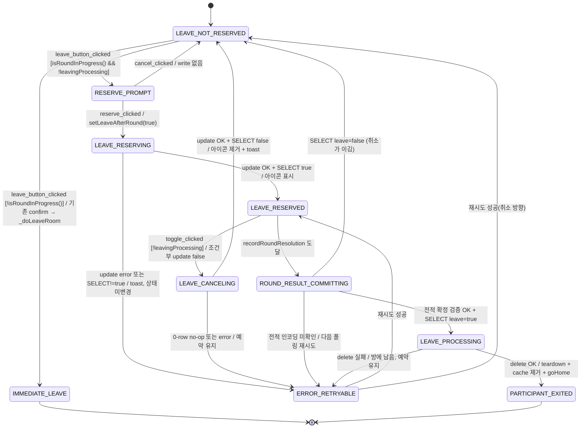
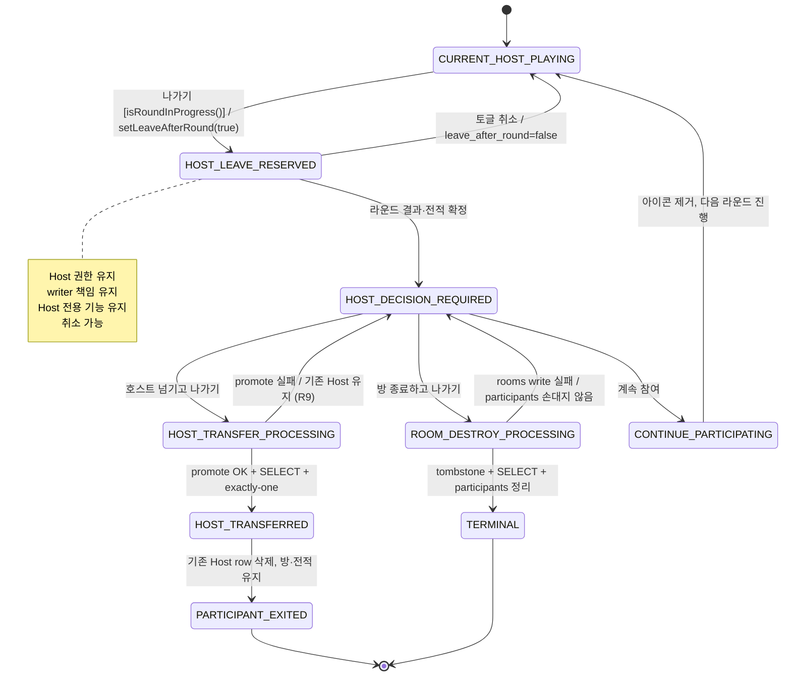
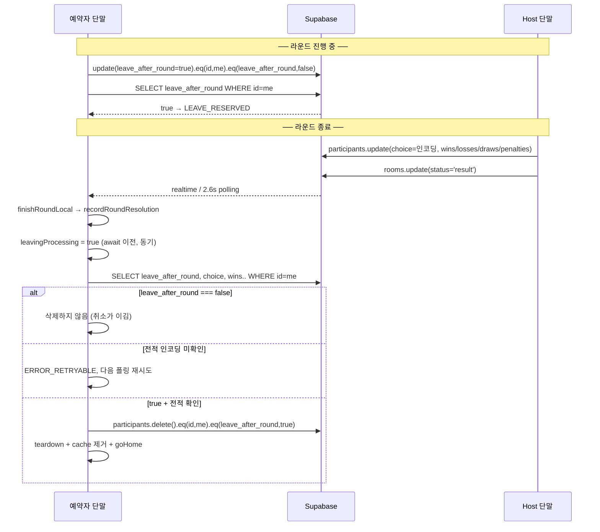
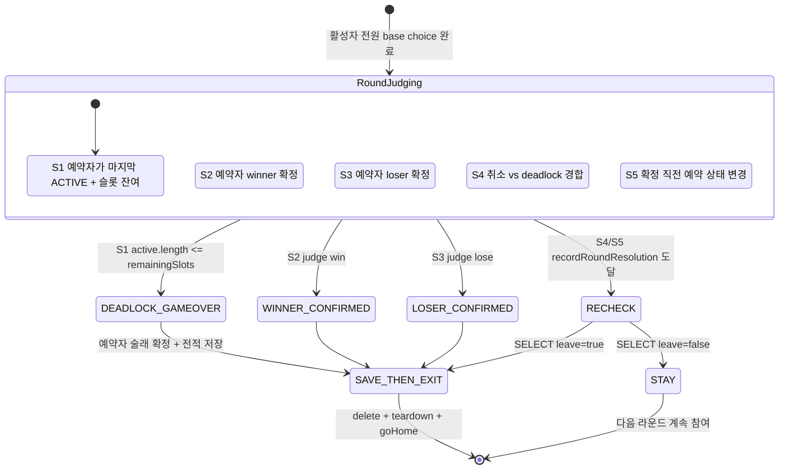

# WRPS-084 Deferred Leave 상태 머신

> **STATUS: Draft — Implementation Pending**
> 기준 HEAD `f6f7eb759fbe99ea0c8d983bbd82f67271115f75`
> **코드와 DB에 아직 미적용.** 이 문서의 함수는 §1-A 확정 규칙과 `(existing)` 표기 항목을 제외하면 전부 설계다.
> CEO 판정(2026-08-05): 문서 품질 PASS / 구현 착수 HOLD.
> 미결 항목은 `docs/WRPS084_DECISION_REGISTER.md`로 분리했다.

라운드 진행 중 나가기를 "퇴장 예약"으로 전환하고, 라운드 결과·전적을 정상 완료한 뒤 퇴장시키는 lifecycle의 상세 정의다.

- **기준 커밋**: `f6f7eb759fbe99ea0c8d983bbd82f67271115f75`
- **상위 문서**: `docs/RPS_ROOM_LIFECYCLE_ARCHITECTURE.md`
- **구현 상태**: 전체 **planned**. 이 문서의 함수 중 코드에 존재하는 것은 `(existing)`으로 명시한다.
- **선행 조건 3개** (§11): DB 마이그레이션 승인 / WRPS-083 2B 완료 / §10-2 결정

---

## 1. 5축 모델에서의 위치

퇴장 예약은 Host 권한 축·라운드 참여 축과 **완전히 독립된 5번째 축**이다.

| 축 | 권위 데이터 | 예약과의 관계 |
|---|---|---|
| Room | `rooms.status` | 독립 |
| Game/Round | `rooms.round`, gameNo | 독립 |
| Host authority | `participants.is_host` | 독립 — Host도 예약할 수 있고, 예약 중에도 Host 권한을 유지한다 |
| Round participation | `participants.choice` → `computePlayerStatuses` | 독립 — 예약자는 ACTIVE 그대로다 (**R6**) |
| **Leave lifecycle** | `participants.leave_after_round` (planned) | 이 문서의 주제 |

**저장 방식**: `participants.leave_after_round boolean not null default false` 신규 컬럼.

**금지된 대안과 이유**
| 대안 | 금지 이유 |
|---|---|
| `choice='__leaving__'` | `choice`는 판정 입력이다. 마커를 넣으면 `isNonPlayingChoice`가 예약자를 판정에서 배제해 **R6 위반**(자동 패배와 동치). 이미 3개 마커로 과적재 상태 |
| `is_ready` 재사용 | 다음 라운드 준비 의사와 퇴장 의사는 동시 성립 가능해 표현 불가 |
| `is_host` 재사용 | Host도 예약할 수 있으므로 표현 자체가 불가능 |
| `PLAYER_STATUS.WAITING` 재사용 | WAITING은 "현재 라운드 미참여". 예약자는 **현재 라운드에 참여한다** — 의미가 정반대 |
| 로컬 전용(DB 없음) | §6 요구사항(타 단말이 예약 아이콘을 본다)이 성립 불가 |

**스키마 확인 결과** (운영 read-only GET):
```
GET /participants?select=leave_after_round&limit=1
→ 400 {"code":"42703","message":"column participants.leave_after_round does not exist"}
대조군 GET /participants?select=is_ready → 200 [{"is_ready":false}]
```
→ **마이그레이션 필요**. 원격 적용은 CEO 별도 승인 전 금지.

---

## 1-A. 확정 규칙 (CEO 승인 2026-08-05) — 판정 중립성

> 이 5개는 **결정 완료**다. 설계·구현·리뷰에서 협상 대상이 아니다.

| ID | 규칙 | 강제 지점 | 검증 |
|---|---|---|---|
| **A** | 퇴장 예약자는 현재 라운드에서 **일반 참가자와 완전히 동일하게 판정한다** | `computePlayerStatuses`(`src/game-logic.mjs:63`)가 `leave_after_round`를 **읽지 않는다**. 예약자의 상태는 ACTIVE 그대로 | L3 / Q2 |
| **B** | 퇴장 예약은 **choice·승패·술래 선정·전적에 영향을 주지 않는다** | 별도 컬럼이라 `choice`·`wins/losses/draws/penalties`와 직교. `judgePure`·`resolveElimination`·`judgeRound` 무변경 | L4 / Q3 |
| **C** | `resolveElimination`의 기존 **deadlock 규칙도 예약자에게 동일하게 적용**한다 | `src/game-logic.mjs:109` — "활성자 ≤ 남은 슬롯이면 전원 술래 확정 후 gameOver". 예약자도 그 활성자에 포함된다 | L3·L10 / Q2 |
| **D** | 예약자가 **술래로 확정되더라도 결과를 정상 저장한 뒤 퇴장**한다 | `processDeferredLeaves`가 `recordRoundResolution` + 전적 인코딩 확인 **뒤에만** 삭제(R8) | L10·L21 / Q4·Q13 |
| **E** | 퇴장 예약자를 **판정 집합에서 제외하는 설계는 금지**한다 | `getActivePlayers:4773`·`publishHostRoundResult:6149`의 active 필터에 `leave_after_round` 조건을 넣지 않는다 | L3 / Q2 |

**규칙 E의 실무적 의미**: 아래 코드는 전부 금지다.
```js
// 금지 — R6/규칙 A·B·E 위반
participants.filter(p => !p.leave_after_round)
if (p.leave_after_round) { /* 자동 패배 / 스킵 / 술래 후보 제외 */ }
choice = '__leaving__'
```
`leave_after_round`를 읽어도 되는 곳은 **UI 렌더**(`getParticipantBadge`, 토글 버튼)와 **퇴장 처리**(`processDeferredLeaves`) 두 곳뿐이다.

**규칙 C·D의 귀결(DR-084-6 결정)**: 예약자가 마지막 ACTIVE이고 술래 슬롯이 남으면 deadlock 분기가 그를 술래로 확정한다. 이것은 정상 동작이다 — 예약은 자동 패배가 아니지만(R6), **자동 면제도 아니다**. 술래 확정 결과는 전적·`confirmedLoserIds`·벌칙에 정상 반영된 뒤 퇴장한다.

---

## 2. 상태 목록

### 2-1. Leave lifecycle (이 문서의 주축)

| 상태 | 의미 |
|---|---|
| `LEAVE_NOT_RESERVED` | 예약 없음(기본값) |
| `LEAVE_RESERVING` | 예약 write 진행 중 |
| `LEAVE_RESERVED` | 예약 확정. 취소 가능 |
| `LEAVE_CANCELING` | 취소 write 진행 중 |
| `ROUND_RESULT_COMMITTING` | 라운드 결과·전적 확정 진행 중. 이 구간부터 취소 불가 |
| `LEAVE_PROCESSING` | 퇴장 처리 진행 중(재조회 → 삭제 → teardown) |
| `PARTICIPANT_EXITED` | 참가자 퇴장 완료 |
| `HOST_DECISION_REQUIRED` | Host 예약자의 라운드 종료 후 3선택 대기 |
| `HOST_TRANSFER_PROCESSING` | 승계 처리 중 |
| `ROOM_DESTROY_PROCESSING` | 방 종료 처리 중(2B 의존) |
| `CONTINUE_PARTICIPATING` | 예약 해제 후 계속 참여 |
| `ERROR_RETRYABLE` | 실패했으나 다음 폴링에서 재시도 가능. 파괴적 write 없음 |
| `TERMINAL` | 홈 복귀 완료. 이 방에 대한 상태 없음 |

### 2-2. Host authority 축 (참조)

`CURRENT_HOST` / `PARTICIPANT` / `HOST_TRANSFER_PENDING` / `HOST_TRANSFERRED` / `ROOM_CLOSING` / `NO_AUTHORITY` — 정의는 ARCHITECTURE §5.

### 2-3. Round participation 축 (참조)

`PARTICIPATING`(= ACTIVE) / `WAITING` / `RESULT_CONFIRMED`(win·lose 확정) / `ROUND_CLOSED` — 정의는 ARCHITECTURE §4, §6.

**예약자는 라운드 종료까지 `PARTICIPATING`을 유지한다.** 이것이 R6이고, mutation Q2/Q3가 이를 지킨다.

---

## 3. Level 2 — 일반 참가자 Deferred Leave



**텍스트 요약**: 라운드 중 나가기 → 확인 팝업 → 예약 write + SELECT 재검증 → 예약됨(아이콘). 아이콘 재클릭 시 조건부 false write + 재검증으로 해제. 라운드 결과가 확정되면 **최신 값을 다시 SELECT**해서 true일 때만 삭제한다. 어느 실패든 파괴적 write 없이 `ERROR_RETRYABLE`로 떨어지고 다음 폴링에서 재시도한다.

### 3-1. 전이 라벨 상세

```
① leave_button_clicked
   [isRoundInProgress() && !state.leavingProcessing]
   / showLeaveReservePopup()
   → RESERVE_PROMPT

② reserve_clicked
   [true]
   / participants.update({leave_after_round:true}).eq('id',me).eq('leave_after_round',false)
     → SELECT id,leave_after_round WHERE id=me
   → LEAVE_RESERVED (SELECT가 true를 반환한 경우에만)

③ toggle_clicked
   [!state.leavingProcessing]
   / participants.update({leave_after_round:false}).eq('id',me).eq('leave_after_round',true)
     → SELECT 재검증
   → LEAVE_NOT_RESERVED + toast(leave.cancelled)

④ round_resolution_recorded
   [state.lastRoundResolution.eventId === 이번 라운드]
   / processDeferredLeaves()
   → LEAVE_PROCESSING 또는 LEAVE_NOT_RESERVED

⑤ delete_ok
   [SELECT leave_after_round === true && 전적 인코딩 확인됨]
   / participants.delete().eq('id',me).eq('leave_after_round',true)
   → PARTICIPANT_EXITED
```

---

## 4. 상태별 상세표 — 일반 참가자

### LEAVE_RESERVED

| 항목 | 내용 |
|---|---|
| 상태 소유자 | 예약한 본인 단말 |
| 권위 데이터 | `participants.leave_after_round = true` |
| 허용 writer | 본인만 |
| 진입 조건 | update OK + SELECT 재검증 true |
| 종료 조건 | 토글 취소 / 라운드 결과 확정 / 방 종료 |
| 금지 동작 | 판정 집합에서 제외, 자동 패배 처리, `choice` 변경, `is_ready` 변경, 즉시 삭제 |
| UI 표시 | 본인: `.leave-after-round-btn` 표시(취소 버튼). 타인: 목록에 `🚪` 배지 |
| DB 상태 | `leave_after_round=true`, `choice`/`is_ready`/`is_host` 무변경 |
| rollback | **가능** — 토글로 언제든 해제 |
| 추적성 | `setLeaveAfterRound` (planned) / L2·L5·L6 / Q1·Q2·Q3 / WRPS-084 / planned |

### ROUND_RESULT_COMMITTING

| 항목 | 내용 |
|---|---|
| 상태 소유자 | 각 단말이 독립적으로 판단 |
| 권위 데이터 | `state.lastRoundResolution` (`index.html:8590`, existing) |
| 허용 writer | host(`publishHostRoundResult:6149`)가 전적을 쓴다. 예약자는 쓰지 않는다 |
| 진입 조건 | `finishRoundLocal`이 `recordRoundResolution`을 기록 |
| 종료 조건 | `processDeferredLeaves` 완료 |
| 금지 동작 | **예약 취소**(§1-3), participant delete(전적 확정 전) |
| UI 표시 | 결과 화면 + 토글 버튼 `disabled` |
| DB 상태 | `wins/losses/draws/penalties` 갱신됨, `choice`에 결과 인코딩 존재 |
| rollback | 불가(라운드 결과는 확정) |
| 추적성 | `finishRoundLocal:8233` (existing) / L19 / Q4 / WRPS-084 / planned(훅만) |

### LEAVE_PROCESSING

| 항목 | 내용 |
|---|---|
| 상태 소유자 | 예약 본인 단말 |
| 권위 데이터 | `state.leavingProcessing = true` (await 이전 동기 설정) |
| 허용 writer | 본인만 (자기 row delete) |
| 진입 조건 | 재조회 `leave_after_round===true` **AND** 전적 인코딩 확인 |
| 종료 조건 | delete OK → teardown → goHome |
| 금지 동작 | 중복 진입, 취소 수락, 타인 row 삭제 |
| UI 표시 | "이 라운드가 끝나 퇴장합니다" 안내 |
| DB 상태 | delete 직전까지 row 존재 |
| rollback | **불가** — 이 상태 진입 후 취소 불가(R7 경계) |
| 추적성 | `processDeferredLeaves` (planned) / L10·L11 / Q4·Q10·Q13 / WRPS-084 / planned |

---

## 5. 참가자 목록·본인 토글 UI (DR-084-5 DECIDED)

| 대상 | 표시 | 위치 | 근거 |
|---|---|---|---|
| **본인** | 화면 한쪽 고정 **퇴장 예약 토글 버튼**(상태 표시 겸 취소 버튼) | `.leave-after-round-btn` 4개 화면(`#screenGame:2643`, `#screenRoundResult:2704`, `#screenWinnerWait:2740`, `#screenLoserWait:2796`) + `updateLeaveAfterRoundButtons()`를 `renderAll:10317`에 1줄 배선 | `.force-start-replay-btn`(`:2634 :2755 :2814` + `updateForceStartReplayButtons:10635`)의 검증된 패턴 복제 |
| **타인** | 참가자 목록 **이름 옆 작은 `🚪`** | `getParticipantBadge:10369` **단일 공통 helper** 한 곳 | `renderParticipants:10383`·`renderReadyList`가 모두 이 함수를 경유 |
| 전파 | — | 코드 추가 **0줄** | `fetchParticipants:6215`가 `select('*')`로 조회해 `state.participants`에 통째로 넣는다. 컬럼 추가만으로 realtime·polling 양 경로에 자동 반영 |

**확정 정책 4항**
1. **단일 공통 helper** — 배지 생성은 `getParticipantBadge` 한 곳에서만. 화면별로 따로 그리지 않는다.
2. **DB false 재검증 후 전 단말 제거** — 취소는 조건부 update + SELECT 재검증이 통과한 뒤에만 UI에서 사라진다. 로컬만 지우고 DB를 쓰지 않는 구현은 금지(mutation Q5가 잡는다).
3. **Host / WAITING / 결과 배지와 독립** — `🚪`는 기존 배지를 대체하지 않고 **병기**한다. host면 `👑`와 함께, WAITING이면 대기 표시와 함께 보인다. 축이 다르므로 상호 배타가 아니다(§1의 5축 모델).
4. **결과 화면 명단은 미표시** — 판정 결과에 집중해야 하고 예약 여부는 판정과 무관하다(확정 규칙 B).

**낙관적 반영**: `state.myLeaveToggleLocallySetAt` 2초 창으로 본인 값 보호. 검증된 선례 `myReadyLocallySetAt`(`index.html:6248`, existing)을 그대로 복제한다.

---

## 6. Level 2 — Host Post-Round Decision



| 선택 | 재사용 함수 | 상태 |
|---|---|---|
| 호스트 넘기고 나가기 | `transferHostAndLeave:11043` — promote → SELECT 재검증 → exactly-one → row 삭제 | **existing** (1단계 검증 로직 그대로) |
| 방 종료하고 나가기 | `destroyRoomByHost:11323` | **existing (2B 완료)** |
| 계속 참여 | `setLeaveAfterRound(false)` | **planned** |

**팝업은 `showNextHostPopup:11025`를 재사용하지 않는다.** 그 팝업은 "나가기 즉시 실행" 문맥이고 2B가 같은 DOM에 "방 종료"를 추가할 예정이라, 결합하면 blast radius가 커진다. `showHostPostRoundPopup` (planned) 별도 신설.

**R10 (방 종료 ⊥ Host 승계)**: `state.leavingProcessing`과 `state.roomClosing`을 각각 await 이전에 동기 설정하고 상호 검사한다.

---

## 5-A. `isRoundInProgress()` — 의미 기반 정의와 진리표 (DR-084-3 DECIDED)

### 핵심 발견 — 별도 countdown 상태는 존재하지 않는다

`startGame`(`index.html:7434-7437`, existing)은 **하나의 write에 status와 카운트다운 앵커를 원자적으로 함께** 싣는다.
```js
state.countdownStartAt = getNextCountdownStartAt();          // :7425  serverNow() + 3600ms
state.penalty = buildPenaltyValue({ gameRound, countdownStartAt });
await db.from('rooms').update({ status: 'playing', penalty: state.penalty })  // :7435
```
따라서 **"권위적 countdown 시작이 확정된 시점" = `rooms.status`가 `'playing'`이 된 시점**이다. 별도의 countdown status나 플래그를 도입할 필요가 없다. `beginNewGameRound:5233`도 같은 원자성을 지킨다(`status === "playing"`일 때만 `countdownStartAt`을 채운다).

반대로 `nextRound:9904`는 `status:'ready'`와 함께 `phaseScheduledAt`만 싣고 `countdownStartAt`은 넣지 않는다 → **`ready`는 항상 "countdown 시작 전"**이다.

> ⚠️ 판정에 `getCountdownStartAt()`(무인자)를 쓰면 안 된다. 이 접근자는 `Math.max(parsed, state.countdownStartAt)`의 **sticky max**라 이전 라운드 값이 남는다(`index.html:4411`). 판정은 `state.status`를 1차 신호로 쓴다.

### 7개 지점 read-only 확인 결과

| 지점 | 위치 | 신호 |
|---|---|---|
| countdown 참가자 snapshot 확정 | `startGame:7413-7423` — `choice=null` 일괄 리셋 후 `__safe__`/`__loser__` 재기록 | 이 write 완료 시점에 이번 라운드 참가 집합이 고정된다 |
| `scheduledStartAt` 생성 | `getNextCountdownStartAt:4549` = `serverNow() + 3600` → `startGame:7425` | `penalty.countdownStartAt` |
| `playing` 전환 | `rooms.update({status:'playing'}):7435` → 로컬 `state.status="playing":7438` → `enterPlayingStateFromRoomUpdate:5500` | `state.status === "playing"` |
| `result` DB write | `publishHostRoundResult:6149` → `updateRoomStatusScheduled("result","result")` (`:6190`, `:6194`) | `state.status === "result"` |
| 결과 저장 진행 중 | `state.publishingRoundResult` (`:6152` set → `:6195` finally clear), `state.finishingRound` (`:8286` set → 분기별 clear) | 두 플래그 |
| 결과 저장 완료 | `finishRoundLocal`의 `recordRoundResolution` → `state.lastRoundResolution` (`:8590`). gameOver면 `autoSaveGameOverResultOnce:8159` / `persistCompletedGameWithRetry:9969` | idempotency 앵커 |
| deferred-leave 처리 시작 | `processDeferredLeaves()`의 `state.leavingProcessing = true` **동기 대입**(planned) | 취소 마감 지점 → §5-B |

### 정의 (planned)

```js
// WRPS-084 DR-084-3: 의미 기반 판정. room.status 열거가 아니라
// "이번 라운드의 판정·저장이 아직 살아 있는가"를 묻는다.
function isRoundInProgress() {
  if (!getOnlineMode()) return false;                       // 오프라인 단일기기: 예약 개념 없음
  if (state.roomClosing || state.status === "destroyed") return false;   // 2B (R10/R11)
  if (state.leavingProcessing) return false;                // 처리 시작 = 진행 중 구간 종료
  if (state.publishingRoundResult || state.finishingRound) return true;  // 저장/판정 진행 중
  if (state.status === "playing" || state.status === "result") return true;
  return false;
}
```

> **필수 호출 순서**: `leaveRoom`은 `isRoundInProgress()`보다 **먼저** `state.leavingProcessing`을 하드 블록해야 한다. 그러지 않으면 처리 중에 들어온 나가기 클릭이 `isRoundInProgress()===false`를 보고 **즉시 퇴장 경로로 새어** `processDeferredLeaves`의 삭제와 경합한다.
> ```js
> async function leaveRoom() {
>   if (state.leavingProcessing) return;          // ← 하드 블록(먼저)
>   if (isRoundInProgress()) { showLeaveReservePopup(); return; }
>   /* 기존 즉시 퇴장 경로 */
> }
> ```

### 최종 진리표

`P` = `publishingRoundResult`, `F` = `finishingRound`, `L` = `leavingProcessing`, `C` = `roomClosing`

| # | `state.status` | countdownStartAt | P | F | L | C | 결과 | 근거 |
|---|---|---|---|---|---|---|---|---|
| 1 | `waiting` | 0 | – | – | f | f | **false** | 라운드 없음 |
| 2 | `lobby` | 0 | – | – | f | f | **false** | 라운드 없음 |
| 3 | `ready` (countdown 전) | 0 | f | f | f | f | **false** | CEO 명시 — `nextRound`가 `countdownStartAt`을 싣지 않는다 |
| 4 | `ready` | 0 | f | **t** | f | f | **true** | 직전 라운드 `finishRoundLocal`이 아직 진행 중 |
| 5 | `playing` | >0 | – | – | f | f | **true** | 권위적 countdown 확정 + 라운드 진행 |
| 6 | `result` | – | – | – | f | f | **true** | 판정·저장 구간 |
| 7 | `result` | – | – | – | **t** | f | **false** | 처리 시작 → 마감(§5-B) |
| 8 | `game_over` (저장 진행 중) | – | **t** 또는 **t** | | f | f | **true** | CEO: "game_over 처리 **완료**"만 제외 |
| 9 | `game_over` (저장 완료) | – | f | f | f | f | **false** | 끝날 라운드가 없다 → 즉시 퇴장 |
| 10 | `stats` | – | f | f | f | f | **false** | 게임 종료 후 |
| 11 | `reinviting` | – | f | f | f | f | **false** | 새 세션 모집 |
| 12 | `penalty_setting` | – | f | f | f | f | **false** | 벌칙 설정 화면 |
| 13 | `destroyed` | – | – | – | – | – | **false** | 2B terminal (R11) |
| 14 | 임의 | – | – | – | – | **t** | **false** | 방 종료 진행 중 (R10) |
| 15 | 오프라인 모드 | – | – | – | – | – | **false** | `getOnlineMode()===false` — DB도 타 단말도 없다 |

**행 4·8이 이 설계의 핵심이다.** `status` 열거만으로 판정하면 두 경우를 놓친다 — 상태값은 이미 다음 단계로 넘어갔지만 이번 라운드의 저장이 아직 살아 있는 구간이며, 여기서 즉시 삭제하면 **R8(저장 전 삭제 금지)을 깨뜨린다.** 이것이 `["playing","result"]` 단순 열거안이 반려된 이유다.

**행 3 대 행 5의 경계**: `ready`→`playing` 전이는 `startGame`의 단일 rooms write로 원자적이다. 그 write가 커밋되기 전 짧은 구간(`state.gameStarting` 구간)은 행 3으로 판정된다 — 즉 즉시 퇴장이 허용된다. `gameStarting`은 rooms write **직전**에 이미 false로 내려가므로(`:7431`, 의도된 설계) 이 플래그로 구간을 막을 수 없다. 이 잔여 경합은 §5-B 말미에 기록한다.

---

## 5-B. 처리 경계 — 취소 허용 마감과 잠금 지점

### 취소 가능 구간
`LEAVE_RESERVED` 상태이고 **`state.leavingProcessing === false`인 동안 언제든** 가능하다(R7). 라운드 결과가 확정되는 중이어도, 아래 잠금 순간 이전이라면 취소가 유효하다.

### 잠금 지점 — 정확한 정의

> **`processDeferredLeaves()`가 `state.leavingProcessing = true`를 동기 대입하는 그 순간부터 취소 불가능하다.**

- 이 대입은 함수 본문의 **첫 `await` 이전**에 실행된다. JS 단일 이벤트 루프에서 대입과 이후 비동기 구간 사이에 다른 클릭 핸들러가 끼어들 수 없으므로 상호배제가 성립한다.
- 호출 위치는 `finishRoundLocal`(`index.html:8233`, existing)의 `recordRoundResolution(payload)` 직후 — 즉 **"이번 라운드 결과가 확정됐다"가 기록된 바로 다음**이다.
- 잠금 이후 토글 버튼은 `disabled`가 되고, `toggleLeaveAfterRound`는 진입부에서 즉시 return한다.

```
… 판정 → recordRoundResolution → state.lastRoundResolution 기록
                                   │
                                   ├── state.leavingProcessing = true   ← ★ 취소 마감
                                   │   (동기, await 이전)
                                   ↓
                              SELECT 재조회 → 조건부 delete → teardown
```

### 2차 안전망 (DB 레벨)
로컬 잠금 이후에도 삭제는 **조건부**다.
```js
participants.delete().eq('id', me).eq('leave_after_round', true)
```
잠금 직전에 다른 경로로 취소가 DB에 커밋됐다면 이 삭제는 **0-row no-op**이 되어 실패한다. 즉 로컬 플래그가 유일한 방어선이 아니다(F4/F5).

### 잠금 해제(재개방)
삭제하지 않고 끝난 경우 `leavingProcessing`을 `false`로 복원해 다시 토글 가능하게 한다.
- 재조회 결과 `leave_after_round === false` (취소가 이김) → `LEAVE_NOT_RESERVED`
- 전적 인코딩 미확인 / delete 실패 → `ERROR_RETRYABLE`, 예약 유지, 다음 라운드 종료에 재시도

### 잔여 경합 (기록)
`ready`→`playing` 원자 write 직전 구간(진리표 행 3)에서는 즉시 퇴장이 허용된다. 이때 `_doLeaveRoom`의 row delete와 `startGame`의 참가자 일괄 write가 겹칠 수 있다. **이는 WRPS-084가 만드는 신규 결함이 아니라 기존 경합이며**, 예약 기능은 이 구간을 넓히지도 좁히지도 않는다. 별도 티켓 대상으로 기록만 한다.

---

## 6-A. Host 오프라인 + row 잔존 — 결정적 orphan 승계 (DR-084-4 DECIDED)

### 공백의 정확한 위치
`ensureHostExists:12980`(existing)은 **host가 0명일 때만** 발화한다. 따라서 두 경우가 갈린다.

| 경우 | 현재 동작 |
|---|---|
| host row가 **사라짐**(정상 이탈) | host 0명 → 2회 연속 관측 후 결정적 승격. **이미 해결됨** |
| host row가 **남아 있음**(강제 종료·네트워크 단절) | `is_host=true` row가 존재 → host 0명이 아니므로 미발화. **방이 writer 없이 정지** |

WRPS-084는 "예약 후 이탈"을 정상 흐름으로 만들기 때문에 두 번째 시나리오의 **노출 빈도를 증가시킨다.**

### 절대 원칙
> **새 Host exactly-one 검증 전 기존 Host row 삭제는 금지한다.**
> 검증 통과 후 권한 제거(`is_host=false`)를 먼저 하고, row 정리는 그 다음이다.

### 오프라인 확정 기준 — 기존 45,000ms 유예 재사용 (CEO 확정)

> **별도 오프라인 임계값을 만들지 않는다.** `cleanupDroppedParticipants:5541`(existing)이 이미 쓰는 **45,000ms** 유예 기준을 그대로 재사용한다.

```js
const dropped = state.participants.filter(p =>
  !p.is_host && !isParticipantOnline(p.id) && !p.is_ready &&
  state.droppedSince[p.id] && now - state.droppedSince[p.id] > 45000   // ← 이 기준
);
```

**구현 시 반드시 확인할 것**: 위 루프는 `!p.is_host` 필터(`:5527`)로 **host를 추적 대상에서 제외**하고, `["waiting","lobby","ready"]` status 게이트(`:5525`)도 걸려 있다. 따라서 host의 `droppedSince` 항목은 현재 채워지지 않는다. **임계값(45,000ms)은 공유하되 host용 관측 기록은 별도로 채워야 한다.** 상수를 매직 넘버로 복제하지 말고 공유 상수로 승격하는 것을 권고한다.

### 승계 8조건 (CEO 확정 — 전부 만족할 때만)
1. **라운드 결과 및 전적 저장 완료** — `state.lastRoundResolution`이 이번 라운드 `eventId`로 기록됐고 `publishingRoundResult`/`finishingRound`가 모두 false. 저장 중 승계하면 writer가 바뀌어 R8이 깨진다
2. **기존 Host가 presence에서 45초 이상 연속 미관측** — 위 기준 재사용
3. **`leave_after_round === true` 또는 기존 dropped 판정 성립** — 단순 일시 오프라인은 승계 사유가 아니다
4. **다른 온라인 참가자 1명 이상** — `isParticipantOnline`인 비host 참가자
5. **`!state.roomClosing`** (R10)
6. **`room.status !== 'destroyed'`** (R11)
7. **Host 승계 / deferred leave 처리 중 아님** — `state.leavingProcessing`, `state.becomingNextHost`, `state.ensuringHostExists` 모두 false
8. **처리 직전 동일 Host의 오프라인 상태 재확인** — 조건 판정과 write 사이의 창에서 Host가 복귀했을 수 있다. 승격 write 직전에 **같은 hostId가 여전히 오프라인인지** 재확인한다. 다르면 중단

**추가 write 게이트 (중복 write 방지)**: 8조건을 만족해도 **결정적 후보 본인만** write한다. `pickDeterministicHostCandidate(온라인 비host 참가자)`의 결과가 `state.currentUserId`가 아니면 관측만 한다. `ensureHostExists:12980`(existing)과 동일 원리로, 다단말이 같은 결론에 도달해도 write는 정확히 1건이다.

### write 순서 (역순 금지)
```
① 결정적 후보 선정                          created_at asc, 동률 시 id asc
                                            pickDeterministicHostCandidate:10844 재사용
② promoteParticipantToHost(candidate)      새 Host 승격 (선행)
③ SELECT 재검증 (is_host === true)          0-row no-op을 성공으로 오인 금지
④ verifyExactlyOneHost(room, preferred)     exactly-one 확인
⑤ ③④ 통과 시에만 old host is_host=false     기존 Host 권한 제거
⑥ 기존 Host row 정리                        cleanupDroppedParticipants 또는 명시 삭제
```

### 복귀 처리
| 복귀 시점 | 결과 |
|---|---|
| **45초 이내 복귀** | Host 권한 **유지**. 승계는 시작되지 않는다(조건 2 미충족) |
| 승계 진행 중 복귀 | 조건 8의 직전 재확인이 잡아 **중단**. 권한 유지 |
| **자동 승계 완료 후 복귀** | **일반 참가자로 처리**. `is_host=false`이므로 R3/R4가 그대로 적용된다 — 과거 Host 이력은 권한 근거가 아니다. 라운드 진행 중이면 재입장 시 WAITING |
②가 실패하면 **아무것도 해제하지 않고 중단한다.** 최악 실패 모드는 "host 2명"(수렴 가능)이고, 절대 "host 0명"(수렴 불가)이 되지 않는다. `becomeNextHost:11080`(existing)이 채택한 순서와 동일하다.

**④와 ⑤의 분리가 절대 원칙의 실행 형태다.** 권한 제거(④)와 row 정리(⑤)는 별개 단계이며, ③ 이전에는 둘 다 실행하지 않는다.

### 복귀한 old host의 처리
`is_host=false`로 강등만 됐으므로 **일반 참가자로 계속 참여**한다. 과거 host 이력은 권한 근거가 되지 않는다(R3/R4). row 삭제는 기존 `cleanupDroppedParticipants:5523`이 담당한다.

### 재사용 함수 (신규 판정 로직 없음)
`pickDeterministicHostCandidate:10844` / `promoteParticipantToHost:10861` / `verifyExactlyOneHost:10896` / `isParticipantOnline` — 전부 existing. 신규는 관측 카운터와 4조건 게이트뿐이다.

| 추적성 | 값 |
|---|---|
| function | `promoteOfflineHostSuccessor` (planned) |
| test | L17, L14, L22 |
| mutation | Q8(새 Host 확인 전 기존 Host 삭제) |
| WRPS | 084 |
| status | **planned — DR-084-4 OPEN** |

---

## 7. Level 3 — DB write sequence



**순서 불변 (R8)**: `전적 write` → `결과 확정` → `재조회` → `삭제`. 역순 금지.

**전적 저장 성공 확인 방법**: `publishHostRoundResult:6149`의 `Promise.all` update는 **error를 검사하지 않는다**(HIGH, §9). 따라서 저장 성공은 **읽기 측에서** 검증한다 — 재조회한 내 row의 `choice`가 이번 라운드 결과 인코딩(`hasConfirmedRoundResult`)을 갖는지 확인한다. `publishHostRoundResult`를 수정하지 않아 blast radius가 최소다.

---

## 7-A. 예약자 퇴장 후 진행 규칙 (post-leave progression)

라운드 종료 후 예약 처리부터 다음 라운드 개시까지의 **확정 순서**다. 각 단계는 앞 단계의 성공을 전제로만 실행한다.

```
① 전적 저장                 host: publishHostRoundResult:6149
                            participants.update(choice=인코딩, wins/losses/draws/penalties)
                            → rooms.update(status='result')
                            [existing]

② 결과 확정                 각 단말: finishRoundLocal:8233 → recordRoundResolution
                            state.lastRoundResolution 기록 (idempotency 앵커)
                            gameOver면 autoSaveGameOverResultOnce / persistCompletedGameWithRetry:9969
                            [existing]

③ 최신 leave_after_round 재조회
                            예약 본인: SELECT leave_after_round, choice WHERE id = me
                            - false  → 삭제하지 않고 종료 (취소가 이김, F5)
                            - true 이고 choice에 결과 인코딩 없음 → ERROR_RETRYABLE (F6, R8 보호)
                            - true 이고 인코딩 확인 → ④로
                            [planned]

④ 일반 예약자 제거           예약 본인: participants.delete()
                                        .eq('id', me).eq('leave_after_round', true)
                            조건부 삭제 — 그 사이 취소가 커밋됐으면 0-row no-op으로 안전 실패
                            Host 예약자는 여기서 삭제하지 않는다 → §6 HOST_DECISION_REQUIRED로
                            [planned]

⑤ 참가자 재조회             남은 단말: fetchParticipants:6215 (realtime participants 이벤트 + 2.6s 폴링)
                            state.participants 갱신
                            [existing]

⑥ Host 복구 필요 여부 확인   ensureHostExists:12980 — host 0명을 연속 2회 관측하면
                            결정적 후보(created_at 최소, 동률 시 id 오름차순) 승격
                            host row가 남아 있는 오프라인 host는 DR-084-4 미결
                            [existing]

⑦ 최소 인원 판정             참가자 0명 → 기존 방 종료 정책 (2B tombstone, planned)
                            참가자 1명 → destroyRoomAndGoHome:11008 (existing, 2B에서 tombstone화)
                            참가자 2명 이상 → ⑧로
                            ⚠ 이 판정은 ⑤의 재조회 결과로만 한다. 삭제 직후의 로컬 추정 금지

⑧ ready 또는 대기실 전환     ACTIVE ≥ 1 → 기존 라운드 전환 경로
                              nextRound:9864 (round+1, status='ready')
                            ACTIVE = 0 ∧ WAITING > 0 ∧ 술래 < 목표 (C-2)
                              → recoverRoundWhenAllPlayersWaiting:13017 (round 유지, ready 재개방)
                            멤버십 변경 감지 시
                              → shouldResetForParticipantChange:4993 → beginNewGameRound
                                 ⚠ 새 게임 회차가 시작된다 — DR-084-2 미결
                            [existing / DR-084-2에 종속]
```

### 리셋 허용 범위 (DR-084-2 DECIDED)

기존 progression을 유지하되, "리셋"의 범위를 **아래 4개로 한정**한다.

| 초기화 **허용** | 근거 |
|---|---|
| `choice` | 다음 라운드 판정 입력이므로 비워야 한다 |
| `is_ready` | 다음 라운드 준비 의사는 새로 받아야 한다 |
| 현재 라운드 임시 marker | `__safe__`/`__loser__`/`__waiting__` — 확정 결과는 `confirmedSafeIds`/`confirmedLoserIds`와 아카이브에 남는다 |
| 다음 ready 상태 | `rooms.status`, `phaseScheduledAt` |

| **절대 초기화 금지** | 보존 지점 |
|---|---|
| 완료 전적 | `archiveCurrentRoundStats:5021` → `getRoomStatsArchive:5055` (roomCode별 localStorage). `beginNewGameRound`가 `priorParticipants`(떠난 사람 포함)로 **먼저** 호출한다 |
| `wins` / `losses` / `draws` | 위 아카이브에 스냅샷된 뒤에만 참가자 row에서 리셋된다 |
| `user_game_history` | `room_id`가 **text·FK 없음** → 방·참가자 삭제와 무관 (`index.html:10217`) |
| `user_game_stats` | `user_id` 기준 upsert (`:10212`) |
| 완료 라운드 결과 | `state.lastRoundResolution` idempotency 캐시가 같은 `eventId`의 재판정을 차단 |
| **같은 게임의 `gameNo`** | 같은 게임을 계속하는 경로에서는 증가시키지 않는다 |

> **구현 시 반드시 확인할 것**: `getNewGameRoundParticipantPatch:4999`(existing)는 현재 `wins/losses/draws/penalties`를 **0으로 리셋**한다. 이 리셋은 `archiveCurrentRoundStats`가 선행 호출된 뒤에만 안전하다. `beginNewGameRound:5220`은 그 순서를 지키고 있다(`archiveCurrentRoundStats` → `resetLocalParticipantsForNewGameRound` → DB patch). **예약자 퇴장 경로가 이 순서를 우회하면 전적이 유실된다** — mutation Q13이 이를 잡는다.

### 전용 progression 사유 `resetReason='deferred_leave'` (CEO 확정)

> **퇴장 예약 처리로 참가자가 제거되는 것만으로 gameNo를 증가시키지 않는다.**

`processDeferredLeaves`는 기존 멤버십 변경 경로를 타지 않고 **전용 사유로 진행**한다.

| 이 경로에서 | 조치 |
|---|---|
| `gameNo` | **유지**(증가 금지) |
| 완료된 round 결과 | 유지 |
| `wins` / `losses` / `draws` | **유지**(0으로 리셋하지 않는다) |
| `user_game_history` / `user_game_stats` | 유지 |
| `choice` | 초기화 |
| `is_ready` | `false` |
| 임시 confirmed marker | 정리 |
| 남은 참가자 | ready 재구성 |

**범위 제한**: `shouldResetForParticipantChange:4993`(existing)의 **일반 정책은 변경하지 않는다.** 중도 이탈·host 승계·강제 종료 등 기존 경로는 지금처럼 새 게임 회차를 시작한다. gameNo를 보존하는 것은 **`processDeferredLeaves`가 호출하는 전용 경로 하나뿐**이다.

> 이 결정으로 `RPS_ROOM_LIFECYCLE_ARCHITECTURE.md §14-3`("같은 게임을 계속하면 gameNo 유지")과의 discrepancy가 해소된다. 예약 퇴장은 §14-3을 준수하고, 그 외 멤버십 변경은 기존 정책을 유지한다 — 두 규칙이 서로 다른 경로에 적용되므로 모순이 아니다.
>
> **구현 주의**: 예약자 삭제를 관측한 다른 단말의 `fetchParticipants:6215`가 `shouldResetForParticipantChange`를 통해 일반 리셋을 트리거할 수 있다. 전용 경로가 성립하려면 그 관측 경로에서도 `deferred_leave`로 인한 제거임을 구분할 수 있어야 한다 — 구현 설계에서 식별 수단을 확정해야 한다(mutation Q13 대상).

**순서 불변식**
- ①②는 ③④보다 **반드시 먼저** (R8 / 규칙 D)
- ③은 ④ 직전에 수행한다 — ②와 ④ 사이에 취소가 들어올 수 있으므로 캐시된 값을 쓰면 안 된다 (F5)
- ⑦은 ⑤ 이후에만 — 삭제 직후 로컬 배열로 인원을 세면 아직 반영되지 않은 다른 단말의 이탈/입장을 놓친다
- ⑥은 ⑤와 ⑧ 사이 — writer가 없는 상태로 ⑧에 진입하면 방이 정지한다

**Host 예약자가 섞인 경우**: 일반 예약자 ④와 Host의 §6 결정은 **독립적으로 진행**한다. 단 Host가 "방 종료하고 나가기"를 선택하면 `roomClosing`이 서고 ⑤~⑧ 전체가 중단된다 (R10/R11).

---

## 8. Level 3 — 실패 및 경합 전이

각 실패의 5개 속성을 명시한다.

| # | 실패 | 파괴적 후속 write | 기존 Host 보존 | 재시도 | 사용자 표시 | 자동 복구 주체 | 최종 안전 상태 |
|---|---|---|---|---|---|---|---|
| F1 | 예약 true write 실패 | **없음** | — | 가능 | `toast.leaveReserveFailed` | 사용자 재클릭 | `LEAVE_NOT_RESERVED` |
| F2 | 예약 true SELECT 재검증 실패 | **없음** | — | 가능 | 동일 | 사용자 재클릭 | `LEAVE_NOT_RESERVED` (아이콘 표시 안 함) |
| F3 | 예약 false write 실패 | **없음** | — | 가능 | `toast.leaveCancelFailed` | 사용자 재클릭 | `LEAVE_RESERVED` 유지 |
| F4 | stale true가 취소 false 뒤 도착 | **없음** | — | — | 없음 | 조건부 update가 0-row no-op으로 무력화 + 2초 낙관 창 | `LEAVE_NOT_RESERVED` |
| F5 | 라운드 종료와 취소 동시 | **없음** | — | — | 없음 | `processDeferredLeaves`의 SELECT가 최종 판정 | DB 최신값 그대로 |
| F6 | 전적 저장 실패 | **삭제 안 함** | — | 가능 | 결과 화면 유지 | 다음 폴링에서 재검증 | `ERROR_RETRYABLE` (R8 보호) |
| F7 | 예약 처리 중 중복 진입 | **없음** | — | — | 없음 | `leavingProcessing` 가드 | 단일 실행 |
| F8 | participant delete 실패 | **없음** | — | 가능 | 방에 남음 | 다음 라운드 종료에 재시도 | `LEAVE_RESERVED` 유지 |
| F9 | Host transfer 실패 | **없음** — 기존 Host row 삭제 안 함 | **보존** | 가능 | `toast.hostTransferFailed` (existing) | 사용자 재선택 | `HOST_DECISION_REQUIRED` |
| F10 | 새 Host가 exactly-one 아님 | 초과분 해제만 | 보존 | — | 없음 | `verifyExactlyOneHost:10896` (existing) | host 정확히 1명 |
| F11 | room destroy write 실패 | **participants 손대지 않음** | 보존 | 가능 | toast | 사용자 재선택 | 방 정상 유지 |
| F12 | destroyed SELECT 재검증 실패 | **participants 손대지 않음** | 보존 | 가능 | toast | 다음 폴링 | 방 정상 유지 |
| F13 | Host 예약 후 오프라인 | — | — | — | 타 단말: 변화 없음 | 결과는 각 단말 `finishRoundLocal`이 독립 확정. host row 소멸 시 `ensureHostExists:12980`(existing)가 2회 관측 후 결정적 승계 | 방 유지 + 새 Host |
| F14 | Host가 이미 사라진 상태 | — | — | — | 없음 | `ensureHostExists` | host 정확히 1명 |
| F15 | 남은 참가자 0명 | 기존 방 종료 정책 | — | — | — | 2B tombstone (planned) | `DESTROYED` |
| F16 | 남은 참가자 1명 | `destroyRoomAndGoHome:11008` (existing) | — | — | `toast.roomClosedAlone` | 남은 단말 | 홈 복귀 |

**F13 잔여 공백**: host가 오프라인이지만 **row는 남아 있으면** host 0명이 아니므로 `ensureHostExists`가 발화하지 않는다. presence 기반 강제 강등은 오탐 시 host 2명을 만들고 2B destroyed 가드와 교차하므로, **WRPS-084 범위에서 새로 만들지 않기를 권고**한다 → §10 미확정 4.

---

## 8-A. 판정 경계 시나리오 5종

확정 규칙 A~E가 실제 판정과 만나는 지점이다. 모두 **예약자를 일반 참가자와 동일하게 처리**한 결과다.



| # | 시나리오 | 판정 결과 | 전적 | 퇴장 | 근거 |
|---|---|---|---|---|---|
| **S1** | 예약자가 마지막 ACTIVE이고 술래 슬롯이 남음 | `resolveElimination` deadlock 분기(`src/game-logic.mjs:109`)가 **예약자를 술래로 확정**하고 gameOver | `losses+1`, `penalties+1` 정상 저장 | 저장 후 퇴장 | 규칙 C·D. 예약은 면제가 아니다 |
| **S2** | 예약자가 winner로 확정 | `WINNER_CONFIRMED`(`__safe__` 마커) | `wins+1` 정상 저장 | 저장 후 퇴장 | 규칙 A·B |
| **S3** | 예약자가 loser로 확정 | `LOSER_CONFIRMED`(`__loser__` 마커), `confirmedLoserIds`에 포함 | `losses+1`, `penalties+1` | 저장 후 퇴장 | 규칙 A·B·D |
| **S4** | 예약 취소와 deadlock 판정이 경합 | **판정은 예약 상태와 무관하게 그대로 진행**된다(규칙 A). 술래 확정도 그대로 | 정상 저장 | ③ 재조회가 `false`면 **퇴장하지 않음**. 술래 확정은 유지된 채 방에 남는다 | 규칙 A + F5 |
| **S5** | 결과 확정 직전 예약 상태 변경 | 판정 무영향 | 정상 저장 | ③의 SELECT 값이 유일한 판정 기준. `ROUND_RESULT_COMMITTING` 진입 후의 토글은 UI에서 `disabled` | R7 경계 + F5 |

**S4의 중요한 귀결**: 취소가 성공해도 **이번 라운드의 술래 확정은 취소되지 않는다.** 예약 취소는 "퇴장하지 않겠다"는 의사일 뿐, 판정 결과를 되돌리는 수단이 아니다(규칙 B). 그 사용자는 술래로 확정된 상태로 다음 라운드/게임에 계속 참여한다.

**S1의 UX 유의**: 예약자가 마지막 활성자면 그가 술래가 되어 게임이 끝난다. "나가려던 사람이 벌칙을 받는" 상황이므로 결과 화면 문구에서 예약 여부를 언급하지 않는 편이 낫다 — 예약과 판정은 무관하다는 규칙 B가 사용자에게도 그대로 보여야 한다.

---

## 9. QA 비간섭성 (R12)

| 항목 | 근거 |
|---|---|
| `QA.emit`은 동기 | `index.html:9073` — `await` 없음 |
| state 쓰기 없음 | `base():9065`가 `state.roomCode`/`currentUserId`/`role`을 **읽기만** 한다 |
| DB/network write 없음 | emit 경로에 없음. `fetch('BUILD_MANIFEST.json')`은 boot 1회 |
| 타이머 | `scheduleSave` `setTimeout(2000)` 1개, `saveTimer`로 coalesce, localStorage만 |
| **주의** | `index.html:12787`이 QA ON일 때 `window.leaveRoom`/`leaveRoomForce`/`endGame`을 **래핑**한다. 래퍼는 `QA.snapshot()` → `flush()` → `localStorage.setItem` 동기 I/O를 수행한 뒤 위임 |

**설계 결론**: WRPS-084의 신규 핸들러(`toggleLeaveAfterRound`, `showHostPostRoundPopup`)는 **래핑 목록에 추가하지 않는다**. 그래야 QA ON/OFF에서 호출 경로가 완전히 동일하다. `leaveRoom`은 이미 래핑 대상이므로 예약 분기가 래퍼 안쪽에 들어가지만, 래퍼는 상태를 바꾸지 않으므로 전이에는 영향이 없다. 검증: L20 / Q12.

---

## 10. 미확정 전이 / 설계 모순

미확정 항목 6건은 **`docs/WRPS084_DECISION_REGISTER.md`로 분리했다.** 각 항목에 선택지·권고안·영향 함수·영향 테스트·미결정 시 위험·CEO 결정 상태가 기록되어 있다.

| ID | 항목 | 심각도 | 상태 | 반영 위치 |
|---|---|---|---|---|
| DR-084-1 | `leave_after_round` DB 마이그레이션 | CRITICAL | **DECIDED**(단계 제한) | §1 저장 방식 / Register 부록 A |
| DR-084-2 | 예약자 퇴장 후 progression / 리셋 범위 | HIGH | **DECIDED** | §7-A |
| DR-084-3 | `isRoundInProgress()` 판정 범위 | HIGH | **DECIDED**(의미 기반) | §5-A |
| DR-084-4 | Host 오프라인 + row 잔존 처리 | MEDIUM | **DECIDED** | §6-A |
| DR-084-5 | 예약 배지 정책 | LOW | **DECIDED** | §5 |
| DR-084-6 | deadlock 분기와 예약자 상호작용 | — | **DECIDED** | §1-A, §8-A |

**설계 모순 점검 결과**: §3~§8-A 전이 중 R1~R12 및 확정 규칙 A~E와 충돌하는 항목은 없다.

### 확인 요청 2건 — 모두 확정됨 (2026-08-05)

1. **Host 오프라인 확정 기준** → **기존 `cleanupDroppedParticipants:5541`의 45,000ms 유예 재사용.** 별도 임계값을 만들지 않는다. 승계 8조건과 복귀 처리는 §6-A.
2. **gameNo 보존 경로** → **전용 사유 `resetReason='deferred_leave'` 신설.** `shouldResetForParticipantChange`의 일반 정책은 무변경이고, `processDeferredLeaves`가 호출하는 전용 경로에서만 gameNo를 보존한다. §7-A.

**남은 구현 blocker 2건** (설계 미결이 아니라 선행 작업)
- 원격 DB에 `leave_after_round` 컬럼 미적용 (DR-084-1, 원격 적용 별도 승인 필요)
- ~~WRPS-083 2B 미구현~~ → **해소.** `destroyRoomByHost`가 existing이 되어 Host 3선택 중 "방 종료하고 나가기"를 재사용할 수 있다

---

## 11. 구현 전 승인 게이트 (§12 대조표)

| # | 게이트 | 상태 |
|---|---|---|
| 1 | 상태 목록 완성 | ✅ §2 |
| 2 | 모든 정상 전이 정의 | ✅ §3, §6 |
| 3 | 모든 실패 전이 정의 | ✅ §8 (F1~F16) |
| 4 | DB writer 소유자 정의 | ✅ §7 + ARCHITECTURE §10 |
| 5 | Host/Participant 권한 구분 | ✅ §1, §6 |
| 6 | 결과 저장과 delete 순서 확정 | ✅ §7 (R8) |
| 7 | 예약 취소 경합 처리 확정 | ✅ §8 F4/F5 (조건부 update CAS + SELECT 최종 판정) |
| 8 | Host 사후 선택 처리 확정 | ✅ §6 |
| 9 | 2B room destroy와 충돌 없음 | ✅ **충족** — 2B 구현 완료(`destroyRoomByHost:11323`). 상호배제 플래그 `roomClosing`/`hostTransferInFlight`도 2B가 도입했다 |
| 10 | 테스트 L1~L22 매핑 | ✅ §12 |
| 11 | mutation Q1~Q14 매핑 | ✅ §13 |
| 12 | CRITICAL/HIGH/MEDIUM 0 또는 수용 | ❌ CRITICAL 1 (§10-1), HIGH 2, MEDIUM 3 |

**→ 게이트 9·12 미충족. 구현 착수 불가.**

---

## 12. 테스트 매핑 (L1~L22)

| ID | 검증 | 대상 전이/상태 |
|---|---|---|
| L1 | 라운드 중 나가기 → delete 0 | ① RESERVE_PROMPT |
| L2 | 예약 → `leave_after_round=true` | ② LEAVE_RESERVING→RESERVED |
| L3 | 판정 집합 유지 | R6 / `computePlayerStatuses` 무영향 |
| L4 | 전적 정상 반영 | R6 / `publishHostRoundResult` |
| L5 | 본인 토글 표시 | §5 |
| L6 | 타 단말 배지 표시 | §5 `getParticipantBadge` |
| L7 | 토글 재클릭 → false | ③ LEAVE_CANCELING |
| L8 | 취소 후 아이콘 제거 | ③ + 전파 |
| L9 | 취소 후 다음 라운드 참여 | LEAVE_NOT_RESERVED |
| L10 | 예약 유지 시 자동 퇴장 | ⑤ LEAVE_PROCESSING |
| L11 | 결과 저장 전 delete 0 | R8 / F6 |
| L12 | Host 예약 중 권한 유지 | §6 HOST_LEAVE_RESERVED |
| L13 | Host 예약 취소 | §6 CONTINUE_PARTICIPATING |
| L14 | 승계 선택 → exactly-one | §6 HOST_TRANSFER_PROCESSING |
| L15 | 방 종료 선택 → destroyed | §6 ROOM_DESTROY_PROCESSING (2B 의존) |
| L16 | 계속 참여 → false | §6 |
| L17 | Host 오프라인 → 자동 승계 | F13 |
| L18 | 역순 도착 시 최신 유지 | F4 |
| L19 | 종료 직전 취소 경합 | F5 |
| L20 | QA ON/OFF 동일 | §9 |
| L21 | 완료 전적 유지 | ARCHITECTURE §14-2 |
| L22 | WAITING/Host/2B 무회귀 | R5/R1/R11 |

## 13. Mutation 매핑 (Q1~Q14)

| ID | mutation | kill하는 테스트 |
|---|---|---|
| Q1 | 예약 즉시 delete | L1 |
| Q2 | 예약자를 판정 집합에서 제외 | L3 |
| Q3 | 예약자 자동 패배 | L4 |
| Q4 | 결과 저장 전 delete | L11 |
| Q5 | 취소가 로컬 UI만 변경 | L7 |
| Q6 | stale true가 false를 덮음 | L18 |
| Q7 | Host 예약 시 권한 즉시 제거 | L12 |
| Q8 | 새 Host 확인 전 기존 Host 삭제 | L14 |
| Q9 | 계속 참여 후 true 유지 | L16 |
| Q10 | 예약 유지인데 자동 퇴장 누락 | L10 |
| Q11 | 아이콘 남고 예약 false | L8 |
| Q12 | QA ON에서 write 순서 다름 | L20 |
| **Q13** | `processDeferredLeaves`를 전적 스냅샷 **앞**으로 이동 | L21 |
| **Q14** | 조건부 update의 `.eq(leave_after_round, 기대값)` 제거(CAS 해제) | L18 |

Q13·Q14는 조사 중 발견해 추가 권고한 항목이다.

---

## 14. 관련 문서

- `docs/RPS_STATE_DIAGRAM_INDEX.md`
- `docs/RPS_ROOM_LIFECYCLE_ARCHITECTURE.md`
